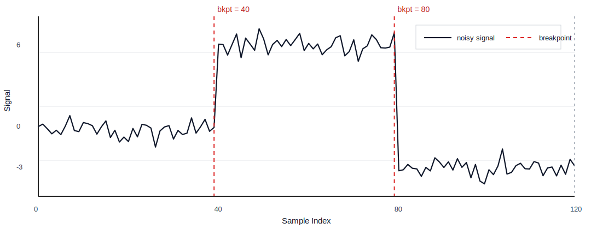
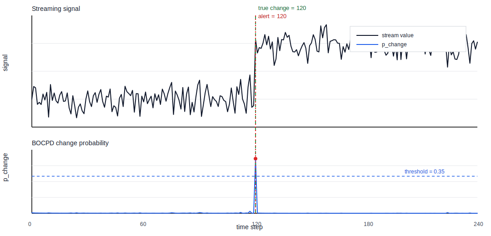

# changepoint-doctor

`changepoint-doctor` is a Rust-first change-point detection toolkit with Python bindings and a recommendation layer that helps choose good detector pipelines. The repository supports both offline (batch) segmentation and online (streaming) change detection. It is designed for practical use first: fast execution, typed outputs, and a clear path from recommendation to execution.

## What this repository provides

- Offline detectors for batch segmentation over univariate and multivariate signals.
- Online detectors for streaming alerts and sequential monitoring.
- A doctor recommendation engine that proposes detector/cost/stopping configurations.
- A Python package, `changepoint-doctor` (`import cpd`), backed by the Rust core.

## Python bindings (highlight)

Install and run quickly:

```bash
python -m pip install changepoint-doctor
```

```python
import numpy as np
import cpd

rng = np.random.default_rng(7)
base = np.concatenate([
    np.zeros(40, dtype=np.float64),
    np.full(40, 6.0, dtype=np.float64),
    np.full(40, -3.0, dtype=np.float64),
])
x = base + rng.normal(0.0, 0.6, size=base.shape[0])

result = cpd.Pelt(model="l2", min_segment_len=2).fit(x).predict(n_bkps=2)
print(result.breakpoints)

try:
    fig = result.plot(x, title="Detected breakpoints")
    fig.savefig("breakpoints.png", dpi=150, bbox_inches="tight")
except ImportError:
    print("Install matplotlib to enable plotting.")
```



```python
# Online BOCPD quickstart (streaming)
import numpy as np
import cpd

rng = np.random.default_rng(11)
stream = np.concatenate([
    rng.normal(0.0, 0.35, 120),
    rng.normal(2.0, 0.35, 120),
]).astype(np.float64)

bocpd = cpd.Bocpd(
    model="gaussian_nig",
    hazard=1.0 / 200.0,
    max_run_length=512,
    alert_policy={"threshold": 0.35, "cooldown": 5, "min_run_length": 10},
)
steps = bocpd.update_many(stream)
first_alert = next((i for i, step in enumerate(steps) if step.alert), None)
print("first BOCPD alert index:", first_alert)
```



Python high-level classes include `cpd.Pelt`, `cpd.Binseg`, `cpd.Fpop`, `cpd.Bocpd`, `cpd.Cusum`, and `cpd.PageHinkley`. For lower-level and doctor-style pipelines, use `cpd.detect_offline(...)`.

## Learn more (Python first)

- [Notebook quickstarts](/Users/admin/Documents/Work/claude-doctor-changepoint/cpd/python/examples/notebooks/README.md)
- [Python quickstart](/Users/admin/Documents/Work/claude-doctor-changepoint/cpd/python/QUICKSTART.md)
- [Python bindings README](/Users/admin/Documents/Work/claude-doctor-changepoint/cpd/python/README.md)
- [Reproducibility modes](/Users/admin/Documents/Work/claude-doctor-changepoint/cpd/docs/reproducibility_modes.md)

## The changepoint doctor function

Use the doctor flow when you want configuration help before running detection. The CLI entrypoint is `cpd doctor`, which returns ranked recommendations with confidence and objective fit.

```bash
cpd doctor --input /path/to/signal.csv --objective balanced --min-confidence 0.2 --output doctor.json
```

After selecting a recommended pipeline, execute it in Python through `cpd.detect_offline(pipeline=...)`. This gives a practical bridge: doctor proposes, Python executes.

## Algorithms: when and how to use them

| Algorithm | Mode | Use when | How to invoke |
| --- | --- | --- | --- |
| PELT | Offline | Strong default when `n` is large and `k` is unknown | `cpd.Pelt(...).fit(x).predict(...)` or `cpd.detect_offline(..., detector="pelt")` |
| BinSeg | Offline | You want a fast approximate segmentation | `cpd.Binseg(...).fit(x).predict(...)` or `cpd.detect_offline(..., detector="binseg")` |
| FPOP | Offline | You want strong pruning behavior with L2 cost | `cpd.Fpop(...).fit(x).predict(...)` or `cpd.detect_offline(..., detector="fpop", cost="l2")` |
| SegNeigh / Dynp | Offline | You know fixed `k` and want exact DP segmentation | `cpd.detect_offline(..., detector="segneigh")` or `cpd.detect_offline(..., detector="dynp")` |
| WBS | Offline | You need robustness to masking or closely spaced changes | `cpd.detect_offline(..., pipeline={"detector": {"kind": "wbs"}, ...})` |
| BOCPD | Online | You need probabilistic change likelihood in streaming data | `cpd.Bocpd(...).update(x_t)` / `update_many(...)` |
| CUSUM | Online | You need lightweight mean-shift monitoring | `cpd.Cusum(...).update(x_t)` / `update_many(...)` |
| Page-Hinkley | Online | You need low-overhead drift/change monitoring | `cpd.PageHinkley(...).update(x_t)` / `update_many(...)` |

Notes:

- Python high-level classes exist for PELT, BinSeg, FPOP, and online detectors.
- `SegNeigh` is available via `detect_offline(detector="segneigh")` or `detect_offline(detector="dynp")`.
- `WBS` is currently available via `detect_offline(pipeline={"detector": {"kind": "wbs"}, ...})`.

## Repository layout (quick map)

- `/cpd/crates/cpd-doctor` - recommendation engine, pipeline selection, and execution helpers.
- `/cpd/crates/cpd-offline` - offline detector implementations.
- `/cpd/crates/cpd-online` - online detector implementations.
- `/cpd/crates/cpd-python` - PyO3 extension module and binding glue.
- `/cpd/python` - Python package, tests, and examples.
- `/cpd/docs` - project docs, contracts, and operational notes.

Detailed API docs and tutorials will be expanded on the Sphinx documentation site.
